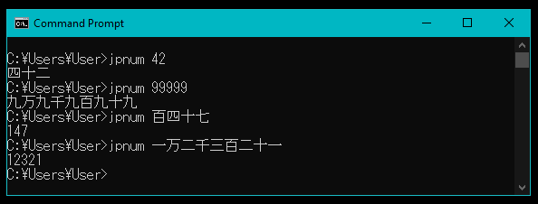
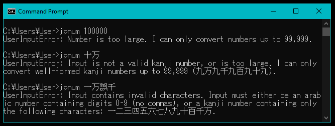

# jpnum

jpnum is a Windows command line program that converts between arabic and Japanese kanji numbers.

## How to install

Download [jpnum.exe](dist/jpnum.exe) from the dist directory to any folder on your computer and run from the Windows Command Prompt.

Note that you will need to change the Command Prompt display font to a font that supports Japanese Unicode characters in order to correctly display kanji inputs and outputs. To do this:

1. Open the Command Prompt
2. Right click the title bar of the Command Prompt window
3. Select 'Properties'
4. In the 'Font' tab, change the font to one that supports Japanese Unicode characters, such as MS Gothic

If you want to type kanji input, you will also need to install a Japanese keyboard on your computer. Click <a href="https://www.tofugu.com/japanese/how-to-install-japanese-keyboard/">here</a> to find out how.

## How to use

It takes a single positional argument that can be either an arabic number or a kanji number.

The maximum input for either number system is 99,999. Providing arguments that are too large or are not valid arabic or kanji numbers will generate UserInputErrors.

